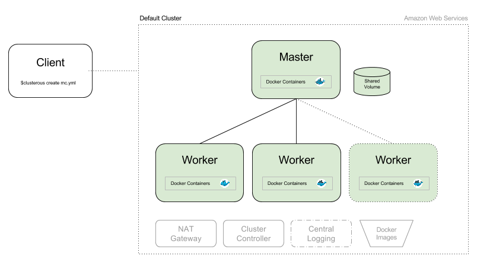

# Architecture

The below diagram shows an overview of a typical Clusterous cluster.

The **client** represents your laptop or desktop with Clusterous installed. You create and operate the cluster from the client machine. Once configured, you use the Clusterous command-line tool to create a cluster in the **Amazon Web Services** cloud.

Your **client** machine creates the cluster with the help of the public AWS API; communication with the cluster itself is achieved via encrypted SSH tunnels.

The **master** and **worker** nodes in the diagram represent the AWS virtual machines on which your application runs. This layout represents Clusterous' default cluster architecture which consists of one master node and any number of **worker** nodes.

A typical cluster application would run some central logic and a job queue on the master node. The main computation work is done by a number of worker processes that run on the worker nodes. Clusterous also allows you to customise this architecture based on your application's needs: for example you may have multiple groups of workers, or multiple masters.

In all cases, your application code and the associated libraries and OS environment run inside a **Docker container**. Docker allows you to easily package your software along with its operating environment, such that you can test your application on your local machine and then deploy it to the cluster without making further modifications.

Each cluster has its own **shared volume**, which is a virtual hard drive accessible to all machines via NFS. By default, the shared volume is 20GB in size, but sizes up to 16TB are supported. The shared volume is based on AWS' [Elastic Block Store](https://aws.amazon.com/ebs/) (EBS) feature.

You may chose to build your own Docker images on the Cluster, in which case they are stored in the **Docker Images** S3 bucket. Unlike all the other cluster resources, the S3 bucket is global to all clusters you create. When setting up Clusterous for first use, you are given the option to either create a new bucket or use an existing one. The shared nature makes it possible to persist your images between cluster runs, and to share the same images with colleagues.

In addition to the above, each cluster has a number of components that play a supporting role in the running of your application.

The **NAT Gateway** helps isolate your cluster behind a private network, allowing scalability and providing security. It acts as the sole gateway to the outside internet. In normal usage, you do not have to directly interact with the NAT gateway.

The **Cluster Controller** acts as the "brains" of the cluster. It helps manage the application virtual machines and their resources, and is responsible for deploying your Docker containers to the cluster nodes. The Controller is also responsible for making the shared volume available across the cluster and for building private Docker images. You do not have to directly interact with the Controller as it functions behind the scenes.

The **Central Logging** system is an optional component that can be enabled at cluster creation. It provides a way to access logging data via a web-based interface and is useful for diagnosing or debugging problems in your application.
