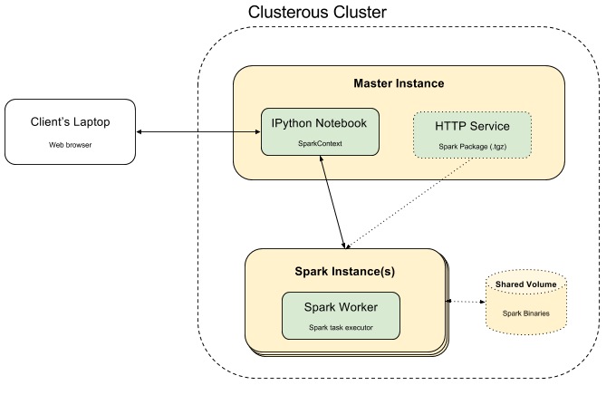

## Spark Environment

This environment gives you an IPython notebook connected to spark instances (see diagram below).
You can specify the number and type of spark instances in the "spark-cluster.yml" file.

A trivial Python example has been added to the default IPython notebook folder.

### Launch

```shell

clusterous create spark-cluster.yml
```

Note: It takes time to launch and configure the cluster. Expect to have the notebook up an running in about 20 minutes.

### Diagram

